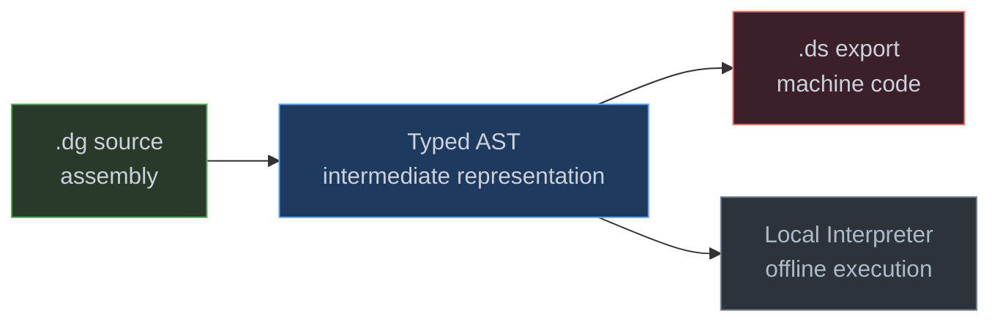
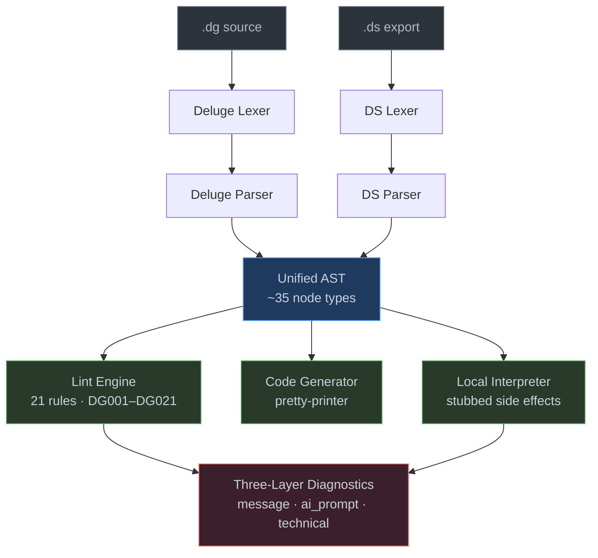
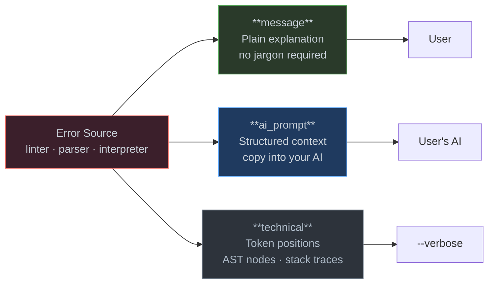

# ForgeDS

A development engine for Zoho Creator. Lint, scaffold, parse, edit, and deploy Deluge scripts and `.ds` exports. Zero external dependencies.

ForgeDS treats Zoho Creator applications as code. It provides the toolchain that Zoho doesn't ship: a formal Deluge language parser, AST-based linting, structured `.ds` manipulation, Access-to-Zoho migration, and a web IDE for AI-assisted development.

---

## At a Glance

ForgeDS is a pip-installable Python package (3.10+, stdlib only) that reverse-engineers Zoho Creator's Deluge language into a proper compiler toolchain. Where Zoho gives you a browser editor and an opaque `.ds` export, ForgeDS gives you a lexer, parser, typed AST, 21-rule linter, code generation, and a local development workflow.

The architecture follows a machine-code model. There is no bytecode stage — the AST is the IR.



---

## Install

```bash
pip install git+https://github.com/HolgerRGevers/ForgeDS.git
```

## Capabilities

| Tool | What it does |
|------|-------------|
| `forgeds-lint` | 21 rules (DG001–DG021), AST-based with three-layer diagnostics |
| `forgeds-lint-access` | 8 rules (AV001–AV008) for Access SQL migration scripts |
| `forgeds-lint-hybrid` | 16 rules (HY001–HY016) for cross-environment validation |
| `forgeds-build-db` | Build `deluge_lang.db` — SQLite reference data (200+ functions, types, operators) |
| `forgeds-build-access-db` | Build `access_vba_lang.db` for Access/VBA analysis |
| `forgeds-scaffold` | Generate `.dg` scripts from a YAML manifest |
| `forgeds-parse-ds` | Parse `.ds` exports, extract forms, scripts, field documentation |
| `forgeds-ds-editor` | Edit `.ds` files: descriptions, reports, menus, dashboards |
| `forgeds-validate` | Pre-flight CSV data validation before Zoho import |
| `forgeds-upload` | Upload to Creator via REST API v2.1 (mock mode by default) |

## Quick Start

```bash
# Install
pip install git+https://github.com/HolgerRGevers/ForgeDS.git

# Create project config
cp templates/forgeds.yaml.example forgeds.yaml

# Build language databases
forgeds-build-db
forgeds-build-access-db

# Lint your Deluge scripts
forgeds-lint src/deluge/
forgeds-lint --fix src/deluge/        # auto-fix DG006, DG007, DG008
forgeds-lint --json src/deluge/       # JSON output for tooling

# Run a script locally (no Zoho needed)
python -m forgeds.runtime script.dg --input '{"Name": "Test"}'

# Parse and manipulate .ds exports
forgeds-parse-ds exports/MyApp.ds --extract-scripts src/deluge/
forgeds-ds-editor audit exports/MyApp.ds
```

---

## Language Engineering

ForgeDS includes a formal language core for Deluge, built from scratch with no external dependencies.

### Architecture



<details>
<summary>Module mapping</summary>

| Block | Source |
|-------|--------|
| Deluge Lexer / Parser | `src/forgeds/lang/` — `tokens.py`, `lexer.py`, `parser.py`, `ast_nodes.py` |
| DS Lexer / Parser | `src/forgeds/lang/` — `ds_lexer.py`, `ds_parser.py` |
| Lint Engine | `src/forgeds/compiler/lint_rules.py` |
| Code Generator | `src/forgeds/compiler/codegen_deluge.py` |
| Local Interpreter | `src/forgeds/runtime/interpreter.py`, `stubs.py`, `environment.py` |
| Diagnostics | `src/forgeds/_shared/diagnostics.py` |

</details>

### Design Decisions

**Hand-written recursive descent parser** with Pratt expression parsing. Deluge has context-sensitive constructs (`for each rec in Form[criteria]`, bracket parameter blocks `[field=val]`) that make parser generators awkward. Error recovery and future incremental parsing for LSP require hand-written control.

**Structural design rule: `[]` inside `{}`**. Action attribute blocks (bracket-delimited `[field=val, ...]`) can only appear as children of statement nodes (control flow `{}`), never bare. This is enforced structurally in the AST — `ParamBlock` nodes exist only inside `InsertStmt`, `SendmailStmt`, `InvokeUrlStmt`.

**Two lexer/parser pairs**. Deluge (`.dg` script files) and DS (`.ds` packaging format) are different languages. Both produce AST nodes, unified at the Program level.

### Error Model

Every diagnostic serves two audiences: the user and the user's AI assistant.



Each error carries three layers of information. The first is a plain explanation — what happened and what to do about it, written for someone who may not know Deluge syntax. The second is a structured AI prompt the user can copy directly into their assistant; it includes the file, line, rule, source code, and enough context for the AI to diagnose and fix without follow-up questions. The third is technical detail — token positions, AST node types, stack traces — hidden by default and available via `--verbose`.

```
  [1] ERROR  script.dg:10  DG005
      Query result 'glRec' accessed without null guard.
      10 | glCode = glRec.gl_code;
      > Prompt for your AI:
        I have a Deluge script issue in `script.dg` at line 10.
        The tool reports [DG005]: Query result 'glRec' accessed without
        null guard. Add: if (glRec != null && glRec.count() > 0)
        The line of code is: `glCode = glRec.gl_code;`
        What is the correct fix? Show me the corrected code.
```

The same structure applies to lexer errors, parser errors (with panic-mode recovery), and runtime interpreter errors. JSON output (`--json`) includes the `ai_prompt` field for web IDE integration.

### Local Interpreter

Deluge has no local runtime — it only executes on Zoho's servers. ForgeDS provides a tree-walking interpreter that evaluates the AST directly. Side effects (`sendmail`, `insert into`, `invokeUrl`) are logged stubs. `input.*` fields come from a provided JSON dict. This enables offline testing without a Zoho account.

```bash
python -m forgeds.runtime script.dg --input '{"Amount": 100, "Status": "Draft"}'
```

The interpreter reports runtime errors (division by zero, infinite loops) using the same three-layer diagnostic model.

---

## Package Structure

```
src/forgeds/
  lang/             Deluge language core (lexer, parser, AST, ~35 node types)
  compiler/         AST-based linter (21 rules) and code generation
  runtime/          Local tree-walking interpreter with stubbed side effects
  core/             Zoho/Deluge tools (lint, build, scaffold, parse, edit)
  access/           Access/VBA migration tools
  hybrid/           Cross-environment tools (validate, upload)
  _shared/          Shared internals (three-layer diagnostics, config)
```

## Project Configuration

All project-specific values come from `forgeds.yaml` in the consumer project root. ForgeDS auto-discovers this file by walking up from the working directory.

```yaml
project:
  name: "My Zoho Creator App"

lint:
  threshold_fallback: "999.99"
  demo_email_domains:
    - "yourdomain.com"

schema:
  table_to_form:
    Departments: "departments"
    Employees: "employees"
```

See [templates/forgeds.yaml.example](templates/forgeds.yaml.example) for the full template.

---

## ForgeDS IDE

**[Launch ForgeDS IDE](https://holgerrgevers.github.io/ForgeDS/)** — a web IDE for AI-assisted Zoho Creator development.

Describe your application in plain language. The IDE generates Deluge code, provides a visual `.ds` editor with element inspection, manages database migrations (Access to Zoho), and builds Custom APIs with AI assistance.

The IDE is fully responsive — desktop multi-panel layout, tablet with narrower panels, and mobile with bottom-sheet navigation. Touch-friendly targets and safe-area support for modern devices.

### Design Language

ForgeDS ships a formal design system in [`DESIGN-LANGUAGE.md`](DESIGN-LANGUAGE.md) covering color tokens, typography, spacing, component patterns, and responsive breakpoints. The design language applies at three levels:

- **ForgeDS IDE** — dark-first aesthetic with blue accent for interactivity, semantic color coding (green/yellow/red for status), and depth hierarchy via background shading
- **AI-generated code** — the built-in skills system injects ForgeDS conventions (field ordering, naming, workflow patterns, status colors) into Claude prompts, so generated Zoho Creator apps inherit the design language where Creator allows customization
- **Zoho Creator apps** — guidance for form design, report layout, dashboard structure, and theme colors that align with the ForgeDS palette

### Running the Bridge

The IDE connects to a local bridge server for code generation.

```bash
pip install websockets
cd ForgeDS
python -m bridge
```

Then open the IDE at [holgerrgevers.github.io/ForgeDS](https://holgerrgevers.github.io/ForgeDS/).

---

## Requirements

- Python 3.10+
- Zero external dependencies (stdlib only)
- Optional: `pyodbc` for Access database operations (Windows)
- Optional: `websockets` for the IDE bridge server

## License

MIT
